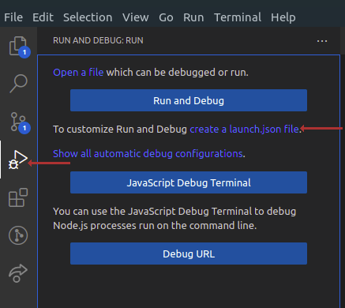
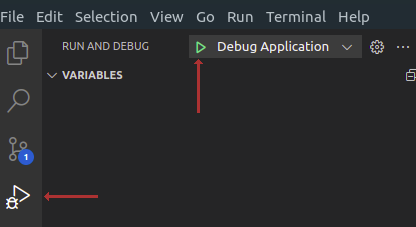
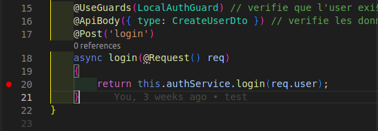
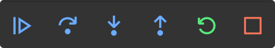

# 💪 VSCODE DEBUGGER



## Remplacer le contenu de launch.json

### Pour Nest:
```json
{
    "version": "0.2.0",
    "configurations": [
        {
            "type": "node",
            "request": "launch",
            "name": "Debug Application",
            "runtimeExecutable": "npm",
            "runtimeArgs": [
                "run",
                "start"
            ],
            "internalConsoleOptions": "openOnSessionStart",
            "outputCapture": "std"
        }
    ]
}
```

### Pour React:
```json
{
    "version": "0.2.0",
    "configurations": [
        {
            "type": "chrome",
            "request": "launch",
            "name": "Launch Chrome against localhost",
            "url": "http://localhost:3000",
            "webRoot": "${workspaceFolder}"
        }
    ]
}
```

## Demarrer le debugger



## <span style="color:red"> ⚠⚠⚠ Pour React faire un `npm start` avant ⚠⚠⚠</span>

## Placez vos breakpoint



## Le code stoppera s'il passe sur le breakpoint

### Choisissez une action



1) <span style="color:green">Continue</span>: appuyez sur cette touche pour poursuivre l'exécution jusqu'au prochain mot-clé de point d'arrêt ou de débogage.

2) <span style="color:green">Step over</span>: cela va « enjamber » la ligne actuelle et passer à la suivante. Ceci est utile si vous souhaitez enjamber une fonction.

3) <span style="color:green">Step into</span>: au lieu de pas au-dessus, sur la ligne d'une fonction, il entrera réellement dans la fonction et y déplacera le débogueur.

4) <span style="color:green">Step out</span>: si nous sommes entrés dans une fonction, nous pouvons revenir en arrière en utilisant ce bouton.

5) <span style="color:green">Restart</span>: vous pouvez redémarrer le script en cours de débogage avec ceci.

6) <span style="color:green">Stop</span>: arrêtez le débogueur.