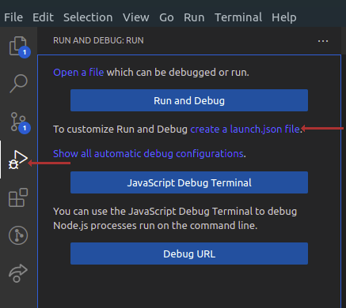
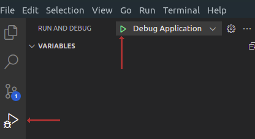

# VSCODE DEBUGGER



## Remplacer le contenu de launch.json par celui ci:

```json
{
    "version": "0.2.0",
    "configurations": [
        {
            "type": "node",
            "request": "launch",
            "name": "Debug Application",
            "runtimeExecutable": "npm",
            "runtimeArgs": [
                "run",
                "start"
            ],
            "internalConsoleOptions": "openOnSessionStart"
        }
    ]
}
```

## Demarrer le debugger



## Placez vos breakpoint


## Le code stoppera s'il passe sur le breakpoint

### Choisissez une action


1) Continue : appuyez sur cette touche pour poursuivre l'exécution jusqu'au prochain mot-clé de point d'arrêt ou de débogage. 
2) Step over: cela va « enjamber » la ligne actuelle et passer à la suivante. Ceci est utile si vous souhaitez enjamber une fonction. 
3) Step into: au lieu de pas au-dessus, sur la ligne d'une fonction, il entrera réellement dans la fonction et y déplacera le débogueur. 
4) Step out: si nous sommes entrés dans une fonction, nous pouvons revenir en arrière en utilisant ce bouton. 
5) Restart: vous pouvez redémarrer le script en cours de débogage avec ceci. 
6) Stop : arrêtez le débogueur.